# FreClean Whitepaper
## Building the Future of Professional Cleaning

**Version:** 1.0  
**Date:** July 2026  
**Company:** FreClean  
**Founder & Chief Executive Officer:** Johnny Dubic

---

> **"Cleaning Beyond Expectations. Empowering Communities. Building the Future."**

---

# Copyright

Copyright © 2026 FreClean.

All rights reserved.

No part of this publication may be reproduced, distributed, or transmitted in any form or by any means without prior written permission from FreClean, except for brief quotations used in reviews, news reporting, or educational purposes.

---

# Disclaimer

This whitepaper presents FreClean's vision, business model, strategic roadmap, and planned ecosystem.

Certain products, technologies, and services described in this document are under development and may evolve over time.

This document is intended for informational purposes only and should not be interpreted as legal, financial, accounting, tax, or investment advice.

FreClean reserves the right to update this document as the company grows and new technologies become available.

---

# Letter from the Founder

## Johnny Dubic
Founder & Chief Executive Officer

Welcome to the FreClean Whitepaper.

FreClean was created with one clear vision: to transform the cleaning industry into a modern, technology-driven ecosystem that creates opportunities for individuals, businesses, and communities.

Cleaning is more than maintaining spaces—it improves health, productivity, safety, and quality of life.

Our mission is to make professional cleaning accessible, reliable, environmentally responsible, and powered by innovation.

FreClean is not simply another cleaning company.

We are building an ecosystem where customers can access trusted services, entrepreneurs can build successful businesses, professionals can receive world-class training, and communities can benefit from sustainable employment opportunities.

Through digital technology, education, strategic partnerships, and operational excellence, we believe FreClean can become one of the leading cleaning ecosystems in the Caribbean before expanding internationally.

This whitepaper represents our long-term vision and commitment to building a company that creates lasting value for customers, employees, partners, and society.

Thank you for being part of this journey.

**Johnny Dubic**  
Founder & Chief Executive Officer  
FreClean

---

# Table of Contents

1. Executive Summary
2. Company Overview
3. Vision
4. Mission
5. Core Values
6. Why FreClean
7. The Problem
8. Market Opportunity
9. Industry Overview
10. Conclusion

---

# Executive Summary

FreClean is a next-generation cleaning ecosystem designed to modernize the professional cleaning industry through technology, education, digital commerce, and sustainable business practices.

Unlike traditional cleaning companies, FreClean combines multiple business units into a single integrated platform, including:

- Residential Cleaning
- Commercial Cleaning
- Industrial Cleaning
- Online Marketplace
- FreClean Academy
- Business Partnerships
- Reseller Opportunities
- Franchise Network
- Employment Marketplace
- Future Mobile Application
- Artificial Intelligence Solutions

Our objective is to improve service quality while creating economic opportunities for thousands of professionals and entrepreneurs.

FreClean aims to become the most trusted cleaning brand in the Caribbean and eventually expand into international markets.

---

# Company Overview

FreClean is a technology-enabled cleaning company focused on delivering reliable, efficient, and environmentally responsible cleaning solutions.

The company combines professional services with digital innovation to simplify booking, improve operational efficiency, and create new opportunities for workers and business owners.

FreClean operates with a long-term vision of becoming a complete ecosystem rather than a traditional service provider.

---

# Vision

To become the most trusted and innovative professional cleaning ecosystem in the Caribbean and a globally recognized leader in technology-driven cleaning services.

---

# Mission

Our mission is to improve lives through professional cleaning, innovation, education, entrepreneurship, and sustainable business practices.

We strive to create cleaner environments, stronger communities, and better economic opportunities for everyone connected to the FreClean ecosystem.

---

# Core Values

## Excellence

We are committed to delivering outstanding service and consistently exceeding customer expectations.

## Integrity

We conduct business with honesty, transparency, and accountability.

## Innovation

We embrace technology and continuous improvement to deliver smarter cleaning solutions.

## Sustainability

We promote environmentally responsible practices that protect people and the planet.

## Community

We believe business should create opportunities, empower people, and strengthen local communities.

## Customer First

Every decision we make begins with understanding and serving our customers.

---

# Why FreClean

FreClean is designed to solve the limitations of traditional cleaning companies by combining services, education, commerce, and technology into one scalable ecosystem.

Key advantages include:

- Professional and standardized cleaning services
- Digital booking and customer management
- Certified training through FreClean Academy
- Marketplace for cleaning products
- Franchise and reseller opportunities
- Future AI-powered operational tools
- Commitment to sustainability
- Strong quality assurance processes

---

# The Problem

The professional cleaning industry faces several persistent challenges:

- Inconsistent service quality
- Limited access to trained professionals
- Manual booking processes
- Lack of technology adoption
- Limited career development opportunities
- Low customer trust in some markets
- Fragmented service providers

FreClean addresses these challenges through a unified digital ecosystem focused on quality, transparency, education, and innovation.

---

# Market Opportunity

Demand for professional cleaning services continues to grow worldwide due to increasing awareness of hygiene, public health, workplace safety, and environmental responsibility.

The Caribbean presents a particularly attractive opportunity because of growth in:

- Residential housing
- Hospitality and tourism
- Commercial real estate
- Healthcare facilities
- Educational institutions
- Corporate offices
- Property management services

FreClean intends to capitalize on these trends through a scalable, technology-driven business model.

---

# Industry Overview

The global cleaning industry is evolving rapidly as customers increasingly expect convenience, reliability, transparency, and digital experiences.

Key industry trends include:

- Online service booking
- Mobile applications
- Eco-friendly cleaning products
- AI-assisted scheduling
- Subscription-based services
- Digital payments
- Workforce management platforms
- Data-driven business operations

FreClean is strategically positioned to leverage these trends and deliver a modern customer experience.

---

# Chapter 1 — The FreClean Ecosystem

## Building More Than a Cleaning Company

FreClean is designed as a complete ecosystem rather than a traditional cleaning business.

Our objective is to connect customers, professional cleaners, entrepreneurs, suppliers, educators, and business partners through one integrated technology platform.

By combining services, education, digital commerce, and workforce development, FreClean creates value for every participant in the ecosystem.

---

# Ecosystem Overview

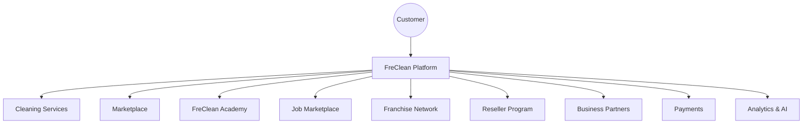

---

# Core Pillars

FreClean is built upon six strategic pillars.

## 1. Professional Cleaning

High-quality cleaning solutions for homes, offices, businesses, and institutions.

---

## 2. Digital Commerce

A marketplace where customers can purchase professional cleaning products and equipment.

---

## 3. Education

Professional training and certification through FreClean Academy.

---

## 4. Entrepreneurship

Helping individuals build profitable cleaning businesses through reseller and franchise programs.

---

## 5. Employment

Creating job opportunities by connecting trained cleaners with customers and business partners.

---

## 6. Technology

Using cloud computing, mobile applications, artificial intelligence, and automation to improve operational efficiency.

---

# Chapter 2 — Professional Cleaning Services

FreClean provides comprehensive cleaning solutions for residential, commercial, and industrial customers.

Every service follows standardized operating procedures to ensure consistent quality and customer satisfaction.

---

## Residential Cleaning

Services include:

- Regular House Cleaning
- Apartment Cleaning
- Deep Cleaning
- Kitchen Cleaning
- Bathroom Sanitization
- Window Cleaning
- Carpet Cleaning
- Sofa & Upholstery Cleaning
- Floor Care
- Move-in Cleaning
- Move-out Cleaning

---

## Commercial Cleaning

Businesses require reliable and professional cleaning solutions.

FreClean supports:

- Office Buildings
- Hotels
- Restaurants
- Banks
- Schools
- Universities
- Hospitals
- Clinics
- Warehouses
- Shopping Centers
- Government Offices

---

## Industrial Cleaning

Industrial environments require specialized expertise.

Services include:

- Warehouse Cleaning
- Factory Cleaning
- Heavy Equipment Cleaning
- Industrial Floor Maintenance
- High-pressure Cleaning
- Safety Compliance Cleaning

---

## Specialized Services

FreClean also provides:

- Post-Construction Cleaning
- Event Cleanup
- Emergency Cleaning
- Disinfection Services
- Eco-Friendly Cleaning
- Pressure Washing

---

# Service Delivery Process

---

# Chapter 3 — FreClean Marketplace

The FreClean Marketplace expands our ecosystem beyond services by providing customers and businesses with access to high-quality cleaning products and equipment.

---

## Product Categories

- Household Cleaning Products
- Commercial Cleaning Chemicals
- Eco-Friendly Solutions
- Vacuum Cleaners
- Mops
- Buckets
- Gloves
- Microfiber Cloths
- Brushes
- Air Fresheners
- Sanitizers
- Safety Equipment

---

## Future Marketplace

Future versions of the platform will allow approved third-party vendors to create their own online stores.

Marketplace benefits include:

- Product Reviews
- Secure Payments
- Inventory Tracking
- Order History
- Promotions
- Business Dashboards

---

# Marketplace Workflow

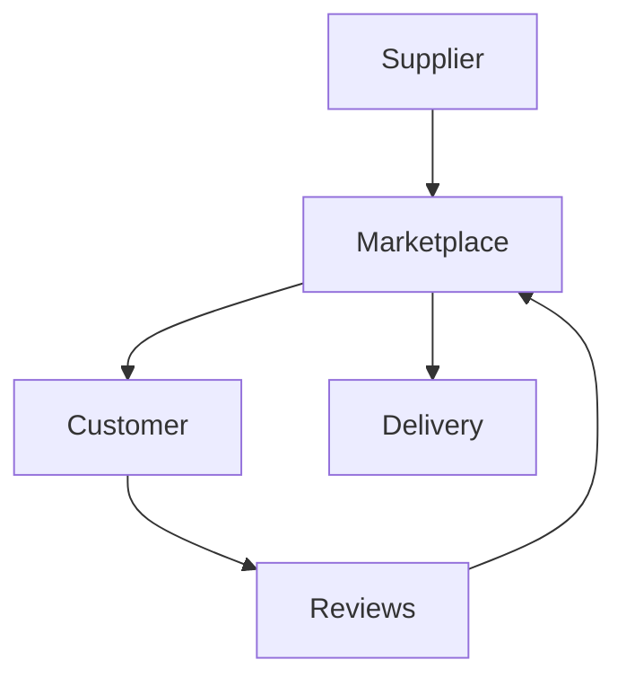

---

# Chapter 4 — FreClean Academy

FreClean Academy is responsible for developing highly skilled cleaning professionals and future entrepreneurs.

Education is one of the company's most important long-term investments.

---

## Training Programs

Students will receive training in:

- Residential Cleaning
- Commercial Cleaning
- Industrial Cleaning
- Chemical Safety
- Equipment Handling
- Customer Service
- Business Management
- Entrepreneurship
- Sales
- Leadership

---

## Certifications

Upon successful completion, students may receive certifications demonstrating their competency according to FreClean standards.

---

## Learning Formats

Training will be available through:

- Online Courses
- In-Person Classes
- Corporate Workshops
- Video Learning
- Practical Training
- Certification Exams

---

# Academy Workflow

---

# Chapter 5 — Employment Marketplace

FreClean is committed to creating sustainable employment opportunities.

The Employment Marketplace connects trained professionals with customers and businesses seeking reliable cleaning services.

Benefits include:

- Verified Cleaner Profiles
- Skills Matching
- Job Notifications
- Performance Ratings
- Secure Payments
- Career Development

---

# Chapter 6 — Franchise & Reseller Network

To accelerate regional expansion, FreClean will develop a scalable franchise and reseller network.

## Franchise Benefits

- Brand Recognition
- Operational Support
- Training
- Marketing Resources
- Technology Platform
- Business Coaching
- Standard Operating Procedures

---

## Reseller Benefits

- Low Startup Costs
- Sales Commissions
- Marketing Materials
- Online Dashboard
- Training Programs
- Business Support

---

# Ecosystem Vision

FreClean is building an ecosystem where:

- Customers receive trusted services.
- Professionals build rewarding careers.
- Entrepreneurs grow successful businesses.
- Partners expand their markets.
- Communities benefit from cleaner, healthier environments.

This integrated model positions FreClean for sustainable long-term growth while creating measurable social and economic impact.

---

# Chapter 7 — Technology Platform

## Digital-First by Design

FreClean is being built as a technology-first company where every service, transaction, and customer interaction is supported by a modern digital platform.

Rather than relying on manual processes, the platform will streamline booking, workforce management, payments, quality assurance, analytics, and customer communication.

The long-term objective is to create a scalable infrastructure capable of supporting thousands of customers, cleaning professionals, franchisees, and business partners across multiple countries.

---

# Technology Principles

FreClean's technology strategy is based on five core principles:

- Scalability
- Security
- Reliability
- Simplicity
- Innovation

These principles guide every product and technology decision.

---

# Platform Architecture

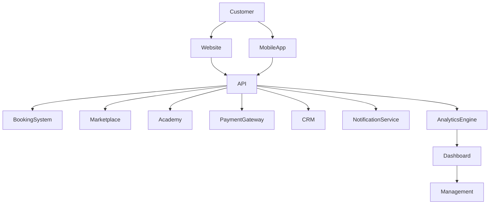

---

# Core Platform Modules

## Customer Portal

The customer portal enables users to:

- Register an account
- Book cleaning services
- Manage appointments
- Track service history
- View invoices
- Make secure payments
- Contact customer support
- Leave reviews

---

## Operations Dashboard

The operations dashboard allows FreClean staff to:

- Manage bookings
- Assign cleaners
- Monitor service quality
- Track performance
- Generate operational reports
- Manage customer requests

---

## Franchise Dashboard

Franchise owners will have access to:

- Financial reports
- Employee management
- Local performance metrics
- Marketing resources
- Customer analytics
- Territory management

---

## Marketplace Dashboard

Marketplace vendors can:

- Manage inventory
- Process orders
- Track sales
- View customer reviews
- Analyze business performance

---

# Chapter 8 — Mobile Application

The FreClean Mobile Application is designed to provide a seamless experience for customers, cleaning professionals, and business partners.

---

## Customer Features

Customers will be able to:

- Book services in minutes
- Receive instant quotations
- Track cleaners in real time
- Receive appointment reminders
- Make digital payments
- Download invoices
- Contact customer support
- Rate completed services
- Earn loyalty rewards

---

## Cleaner Features

Cleaning professionals will be able to:

- Accept or decline jobs
- View schedules
- Navigate to customer locations
- Complete digital checklists
- Upload before-and-after photos
- Record completed work
- Receive payments
- Track earnings
- Access training resources

---

## Business Features

Business clients will benefit from:

- Multi-location management
- Monthly reporting
- Service scheduling
- Team management
- Corporate invoicing
- Dedicated account support

---

# Mobile Workflow

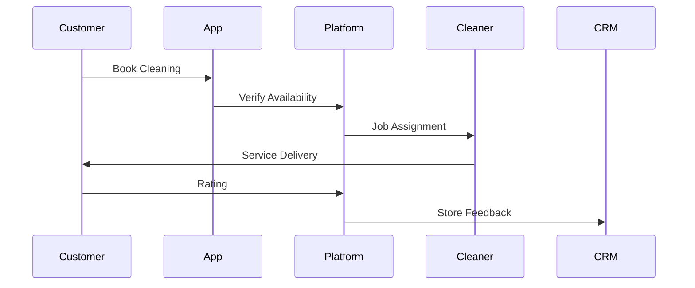

---

# Chapter 9 — Artificial Intelligence

Artificial Intelligence will play an important role in the future evolution of the FreClean ecosystem.

AI technologies will improve operational efficiency while enhancing customer experience.

---

## Planned AI Capabilities

### Smart Scheduling

Automatically assign cleaners based on:

- Distance
- Availability
- Skill level
- Customer preferences
- Traffic conditions

---

### Intelligent Pricing

Pricing recommendations may consider:

- Property size
- Service complexity
- Cleaning duration
- Market demand
- Seasonal trends

---

### Predictive Analytics

AI models will help forecast:

- Customer demand
- Workforce requirements
- Product inventory
- Revenue trends
- Business growth opportunities

---

### AI Customer Assistant

An intelligent assistant will help customers:

- Book services
- Modify appointments
- Answer common questions
- Track orders
- Receive personalized recommendations

---

# AI Workflow

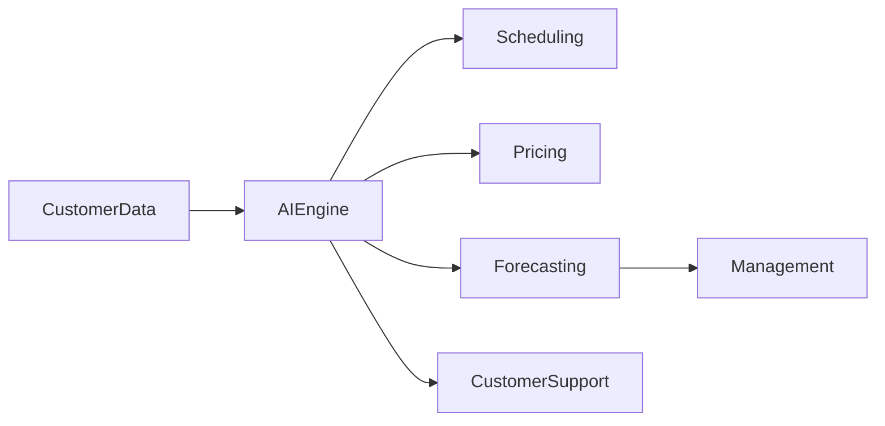

---

# Chapter 10 — Payment Ecosystem

FreClean aims to provide secure, flexible, and accessible payment solutions.

Supported payment methods may include:

- Cash
- Credit Cards
- Debit Cards
- Bank Transfers
- Digital Wallets
- CELO
- cUSD
- Additional regional payment methods

This flexible payment infrastructure is designed to support both local customers and future international expansion.

---

# Payment Architecture

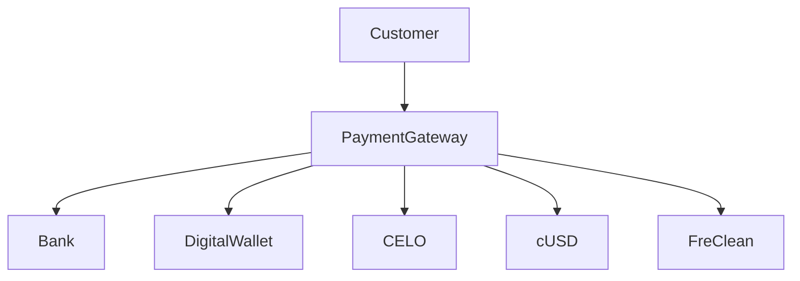

---

# Benefits of Digital Payments

Digital payments provide several advantages:

- Faster transactions
- Better financial transparency
- Reduced cash handling
- Easier accounting
- Improved customer convenience
- Enhanced business reporting

---

# Chapter 11 — Security & Privacy

Security is one of FreClean's highest priorities.

The company is committed to protecting customer information, financial transactions, operational systems, and business data through industry-recognized security practices.

---

## Security Framework

FreClean plans to implement:

- End-to-end encryption
- Multi-factor authentication
- Role-based access control
- Secure cloud infrastructure
- Continuous monitoring
- Automated backups
- Fraud detection
- Security audits

---

## Privacy Principles

FreClean is committed to respecting user privacy through responsible data management.

Our privacy principles include:

- Transparency
- Accountability
- Data minimization
- Secure storage
- User consent
- Responsible data retention

---

# Business Continuity

To ensure uninterrupted operations, FreClean intends to maintain:

- Disaster recovery procedures
- Infrastructure redundancy
- Automatic backups
- Performance monitoring
- Incident response plans
- Regular business continuity testing

---

# Technology Vision

Technology is not simply a support function at FreClean.

It is a strategic foundation that enables innovation, operational excellence, customer satisfaction, and long-term scalability.

As new technologies emerge, FreClean will continue investing in secure, intelligent, and customer-focused digital solutions that strengthen its ecosystem and create lasting value.

---

# Chapter 12 — Business Model

## A Diversified Business Ecosystem

FreClean is designed around a diversified business model that combines services, commerce, education, technology, and strategic partnerships.

Rather than relying on a single revenue source, FreClean generates value through multiple integrated business units that reinforce one another.

This approach strengthens financial resilience while supporting long-term growth.

---

# Business Model Overview

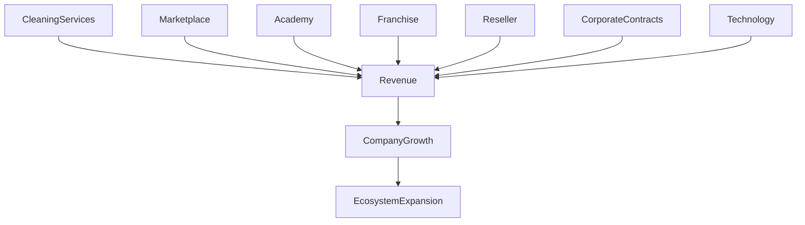

---

# Primary Revenue Streams

## 1. Professional Cleaning Services

The primary source of revenue comes from high-quality residential, commercial, and industrial cleaning services.

Examples include:

- Residential cleaning
- Office cleaning
- Hospitality cleaning
- Healthcare cleaning
- Industrial cleaning
- Post-construction cleaning
- Specialized sanitation services

---

## 2. FreClean Marketplace

The online marketplace generates revenue through:

- Direct product sales
- Third-party seller commissions
- Featured product listings
- Business subscriptions
- Promotional advertising

---

## 3. FreClean Academy

Education creates sustainable revenue through:

- Professional certifications
- Online courses
- Corporate training
- Workshops
- Educational subscriptions

---

## 4. Franchise Network

Franchise revenue includes:

- Initial franchise fees
- Annual renewal fees
- Technology licensing
- Operational support services
- Continuing education

---

## 5. Reseller Program

Revenue is generated through product distribution while empowering local entrepreneurs.

Benefits include:

- Low startup costs
- Sales commissions
- Business mentoring
- Marketing resources

---

## 6. Corporate Partnerships

FreClean develops long-term agreements with:

- Hotels
- Property managers
- Hospitals
- Schools
- Restaurants
- Government institutions
- Commercial buildings

These contracts provide recurring and predictable revenue.

---

# Revenue Distribution (Illustrative)

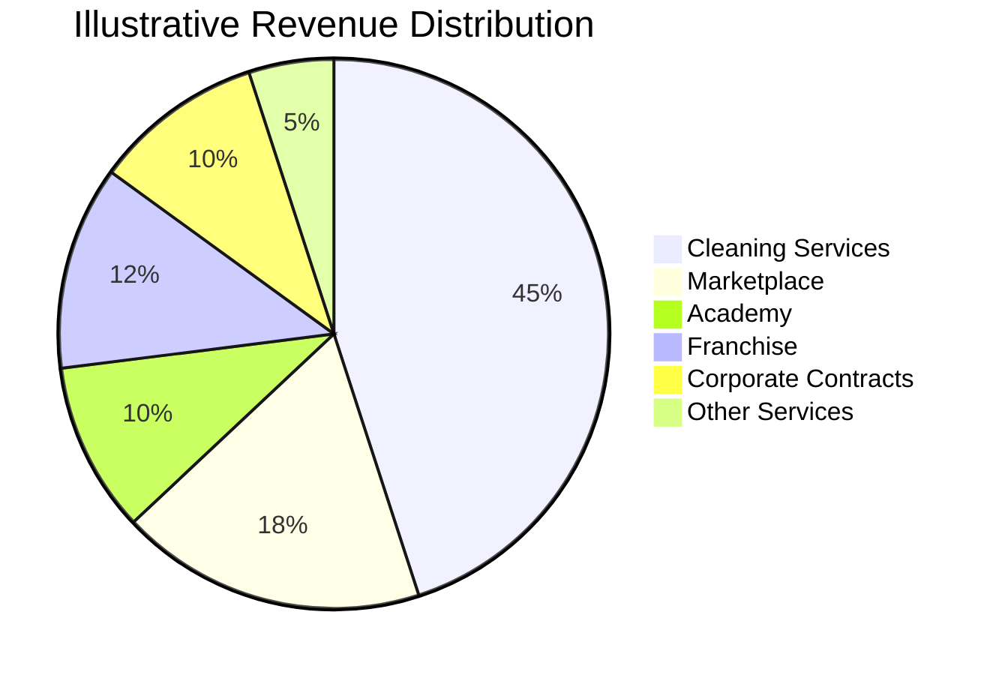

---

# Chapter 13 — Marketing Strategy

## Brand Position

FreClean positions itself as a trusted, innovative, and technology-driven cleaning ecosystem focused on quality, reliability, sustainability, and customer satisfaction.

Our brand represents professionalism, consistency, and long-term value.

---

# Marketing Objectives

FreClean aims to:

- Build strong brand recognition
- Increase customer acquisition
- Improve customer retention
- Expand regional market share
- Support franchise growth
- Promote sustainable cleaning practices

---

# Marketing Channels

## Digital Marketing

FreClean will leverage:

- Search Engine Optimization (SEO)
- Content Marketing
- Email Marketing
- Social Media
- Online Advertising
- Mobile Marketing

---

## Community Engagement

Community involvement is a core component of the FreClean brand.

Examples include:

- Community clean-up campaigns
- Environmental awareness programs
- Educational workshops
- School partnerships
- Volunteer initiatives

---

## Referral Program

FreClean intends to reward loyal customers through referral incentives, helping accelerate organic growth while strengthening customer relationships.

---

# Customer Journey

---

# Chapter 14 — Competitive Analysis

The professional cleaning industry is highly competitive, yet many providers remain limited by manual processes, inconsistent service quality, and outdated business models.

FreClean differentiates itself by combining technology, education, commerce, workforce development, and business opportunities within a single ecosystem.

---

# Competitive Advantages

- Technology-driven operations
- Digital booking platform
- Mobile application
- Marketplace integration
- Professional training academy
- Franchise expansion model
- Data-driven decision making
- Strong quality assurance
- Commitment to sustainability

---

# Competitive Comparison

| Capability | Traditional Cleaning Companies | FreClean |
|------------|-------------------------------|-----------|
| Online Booking | Limited | ✓ |
| Mobile Application | Rare | ✓ |
| Marketplace | No | ✓ |
| Training Academy | No | ✓ |
| Franchise System | Limited | ✓ |
| Data Analytics | Limited | ✓ |
| AI Roadmap | Rare | ✓ |
| Sustainability Programs | Partial | ✓ |

---

# Chapter 15 — SWOT Analysis

## Strengths

- Diversified ecosystem
- Scalable business model
- Multiple revenue streams
- Strong technology strategy
- Professional standards
- Long-term vision

---

## Weaknesses

- Significant initial investment
- Brand awareness in early stages
- Technology development costs
- Expansion requires operational discipline

---

## Opportunities

- Growing global demand for cleaning services
- Increasing digital adoption
- Expansion throughout the Caribbean
- Strategic partnerships
- Government contracts
- Eco-friendly cleaning solutions

---

## Threats

- Market competition
- Economic instability
- Labor shortages
- Regulatory changes
- Cybersecurity threats

---

# SWOT Matrix

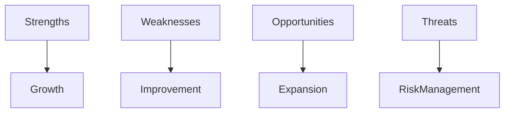

---

# Chapter 16 — Risk Management

Effective risk management is essential to the long-term success of FreClean.

The company continuously evaluates operational, financial, technological, legal, and strategic risks.

---

## Operational Risks

Potential risks include:

- Workforce shortages
- Scheduling conflicts
- Equipment failures
- Service interruptions

Mitigation strategies include standardized procedures, staff training, preventive maintenance, and operational monitoring.

---

## Financial Risks

Potential risks include:

- Cash flow fluctuations
- Inflation
- Rising operating costs
- Customer payment delays

FreClean mitigates these risks through diversified revenue sources, budgeting, financial forecasting, and disciplined cost management.

---

## Technology Risks

Potential risks include:

- Cybersecurity attacks
- System outages
- Data loss
- Software vulnerabilities

FreClean addresses these risks through continuous monitoring, encryption, secure authentication, backups, and regular security assessments.

---

# Risk Matrix

| Risk | Probability | Impact | Priority |
|------|------------|--------|----------|
| Cybersecurity | Medium | High | High |
| Staff Shortage | Medium | High | High |
| Equipment Failure | Medium | Medium | Medium |
| Economic Downturn | Low | High | Medium |
| Service Disruption | Medium | Medium | Medium |

---

# Chapter 17 — Corporate Governance

FreClean believes strong governance builds trust among customers, employees, investors, and business partners.

Our governance framework is based on integrity, accountability, transparency, ethical leadership, and continuous improvement.

---

# Governance Structure

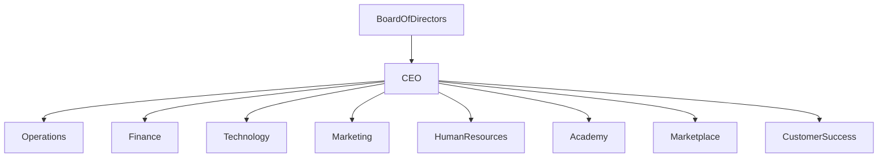

---

# Leadership Responsibilities

## Founder & Chief Executive Officer

Johnny Dubic provides strategic leadership, defines the long-term vision, builds partnerships, and oversees the company's overall direction.

## Executive Leadership Team

The executive team is responsible for:

- Business operations
- Financial management
- Technology development
- Marketing strategy
- Human resources
- Customer experience
- Innovation
- Regulatory compliance

---

# Governance Principles

- Integrity
- Accountability
- Transparency
- Compliance
- Customer Trust
- Innovation
- Long-Term Sustainability

---

# Chapter 18 — Strategic Roadmap (2026–2030)

FreClean's long-term strategy is divided into carefully planned phases to ensure sustainable growth, operational excellence, and international expansion.

---

## Phase 1 — Foundation (2026)

Objectives:

- Official company launch
- Brand identity development
- Corporate website launch
- Initial cleaning services
- Customer support system
- Standard Operating Procedures (SOPs)
- Initial team recruitment
- Digital marketing campaigns
- First strategic partnerships

Success Indicators:

- First 500 customers
- Strong online presence
- Operational service model established

---

## Phase 2 — Digital Growth (2027)

Objectives:

- Launch FreClean Mobile App
- Online booking platform
- Marketplace MVP
- Customer loyalty program
- CRM implementation
- Business analytics dashboard

Success Indicators:

- 5,000 registered users
- Marketplace operational
- High customer satisfaction

---

## Phase 3 — Ecosystem Expansion (2028)

Objectives:

- Launch FreClean Academy
- Certification programs
- Franchise pilot program
- Reseller network
- Employment Marketplace
- AI scheduling prototype

Success Indicators:

- 100+ certified professionals
- First franchise locations
- Regional partnerships

---

## Phase 4 — Regional Leadership (2029)

Objectives:

- Expand across the Caribbean
- Enterprise customer acquisition
- AI-powered operations
- Advanced analytics
- Corporate partnerships

Success Indicators:

- Multiple regional operations
- Thousands of active customers
- Sustainable recurring revenue

---

## Phase 5 — International Expansion (2030)

Objectives:

- Enter additional international markets
- Expand franchise network
- Introduce new digital services
- Strengthen technology platform
- Build a globally recognized brand

Success Indicators:

- International operations
- Strong partner ecosystem
- Global brand recognition

---

# Roadmap Timeline

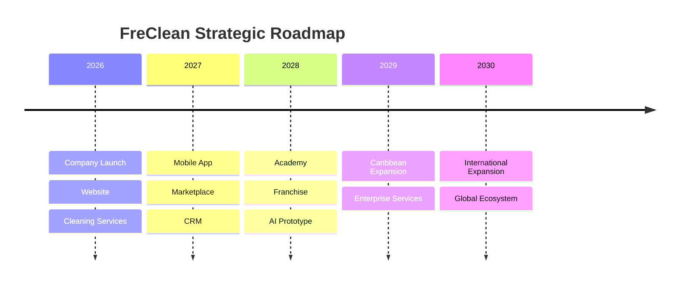

---

# Chapter 19 — Key Performance Indicators (KPIs)

FreClean will monitor measurable indicators to evaluate growth and operational performance.

## Customer KPIs

- Customer Satisfaction Score (CSAT)
- Net Promoter Score (NPS)
- Customer Retention Rate
- Customer Acquisition Cost
- Average Response Time

---

## Operational KPIs

- Jobs Completed
- On-Time Arrival Rate
- Average Cleaning Duration
- Service Quality Score
- Employee Productivity

---

## Financial KPIs

- Monthly Revenue
- Annual Revenue Growth
- Gross Profit Margin
- Operating Margin
- Cash Flow
- Marketplace Revenue
- Franchise Revenue

---

## Technology KPIs

- Platform Availability
- Mobile App Downloads
- API Response Time
- System Uptime
- Security Incidents

---

# Chapter 20 — Sustainability & ESG

FreClean is committed to sustainable business practices that create positive environmental and social impact.

## Environmental

- Promote eco-friendly cleaning products
- Reduce waste
- Encourage responsible chemical use
- Optimize transportation efficiency
- Support recycling initiatives

---

## Social

- Job creation
- Skills development
- Equal opportunities
- Community cleaning initiatives
- Youth empowerment

---

## Governance

- Ethical leadership
- Transparency
- Regulatory compliance
- Accountability
- Responsible decision-making

---

# Chapter 21 — Global Expansion Strategy

FreClean intends to expand using a structured growth model.

Expansion priorities include:

1. Dominican Republic
2. Haiti
3. Caribbean Region
4. North America
5. Latin America
6. Europe
7. Africa

Expansion will be based on:

- Market demand
- Strategic partnerships
- Franchise opportunities
- Technology readiness
- Operational capacity

---

# Chapter 22 — Conclusion

FreClean represents more than a cleaning company.

It is a long-term vision to modernize the cleaning industry through technology, education, entrepreneurship, sustainability, and operational excellence.

By integrating professional services, digital commerce, workforce development, artificial intelligence, and strategic partnerships into one ecosystem, FreClean aims to become a trusted leader in the Caribbean and beyond.

Our commitment is simple:

Deliver exceptional service.

Create meaningful opportunities.

Build cleaner communities.

Drive sustainable innovation.

This whitepaper serves as the foundation for FreClean's future and reflects our commitment to building an organization that creates lasting value for customers, employees, partners, investors, and society.

---

# Appendix A — Service Categories

Residential Cleaning

Commercial Cleaning

Industrial Cleaning

Healthcare Cleaning

Hospitality Cleaning

Educational Facilities

Government Buildings

Post-Construction Cleaning

Pressure Washing

Window Cleaning

Carpet Cleaning

Deep Cleaning

Sanitization Services

---

# Appendix B — Core Technologies

Cloud Infrastructure

Artificial Intelligence

Customer Relationship Management (CRM)

Marketplace Platform

Mobile Applications

Digital Payments

Business Intelligence

Cybersecurity

Automation

---

# Appendix C — Corporate Principles

Customer First

Integrity

Innovation

Excellence

Accountability

Sustainability

Continuous Improvement

Community Impact

---

# Glossary

**AI** – Artificial Intelligence

**CRM** – Customer Relationship Management

**ESG** – Environmental, Social, and Governance

**KPI** – Key Performance Indicator

**SOP** – Standard Operating Procedure

**API** – Application Programming Interface

---

# References

This whitepaper is based on internationally recognized business planning principles, technology best practices, sustainability frameworks, and operational management methodologies. As FreClean evolves, future editions may incorporate additional research, standards, and strategic updates.

---

# About FreClean

**FreClean**

Building the Future of Professional Cleaning.

Founded by **Johnny Dubic**

Vision:
To become the most trusted technology-driven cleaning ecosystem in the Caribbean and a globally recognized leader in professional cleaning services.

© 2026 FreClean. All Rights Reserved.